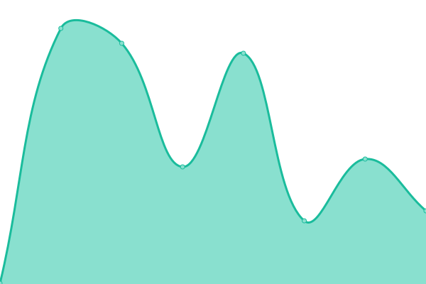
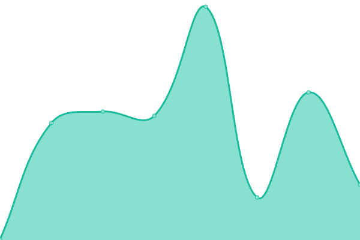
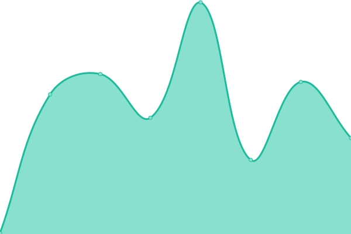

# [📈 Live Status](https://up.pvl.pub): <!--live status--> **🟩 All systems operational**

This repository contains the open-source uptime monitor and status page for [okkilee](https://up.pvl.pub), powered by [Upptime](https://github.com/upptime/upptime).

With [Upptime](https://upptime.js.org), you can get your own unlimited and free uptime monitor and status page, powered entirely by a GitHub repository. We use [Issues](https://github.com/okkilee/up/issues) as incident reports, [Actions](https://github.com/okkilee/up/actions) as uptime monitors, and [Pages](https://up.pvl.pub) for the status page.

<!--start: status pages-->
<!-- This summary is generated by Upptime (https://github.com/upptime/upptime) -->
<!-- Do not edit this manually, your changes will be overwritten -->
<!-- prettier-ignore -->
| URL | Status | History | Response Time | Uptime |
| --- | ------ | ------- | ------------- | ------ |
|  [hub.cid.agilent.com](https://hub.cid.agilent.com) | 🟩 Up | [hub-cid-agilent-com.yml](https://github.com/okkilee/up/commits/HEAD/history/hub-cid-agilent-com.yml) | 

 129ms
     
 | 

<a href="https://up.pvl.pub/history/hub-cid-agilent-com">100.00%</a>
    

|  [hub for stg-51](https://hub.stg-51.aws.agilent.com) | 🟩 Up | [hub-for-stg-51.yml](https://github.com/okkilee/up/commits/HEAD/history/hub-for-stg-51.yml) | 

 158ms
     
 | 

<a href="https://up.pvl.pub/history/hub-for-stg-51">100.00%</a>
    

|  [hub for tst-51](https://hub.tst-51.aws.agilent.com) | 🟩 Up | [hub-for-tst-51.yml](https://github.com/okkilee/up/commits/HEAD/history/hub-for-tst-51.yml) | 

 135ms
     
 | 

<a href="https://up.pvl.pub/history/hub-for-tst-51">100.00%</a>
    

|  [Jenkins pipeline](https://jenkins.prd-51.aws.agilent.com/login) | 🟩 Up | [jenkins-pipeline.yml](https://github.com/okkilee/up/commits/HEAD/history/jenkins-pipeline.yml) | 

 148ms
     
 | 

<a href="https://up.pvl.pub/history/jenkins-pipeline">100.00%</a>
    

<!--end: status pages-->

[**Visit our status website →**](https://up.pvl.pub)

## 📄 License

- Powered by: [Upptime](https://github.com/upptime/upptime)
- Code: [MIT](./LICENSE) © [Anand Chowdhary](https://anandchowdhary.com), supported by [Pabio](https://pabio.com)
- Data in the `./history` directory: [Open Database License](https://opendatacommons.org/licenses/odbl/1-0/)
